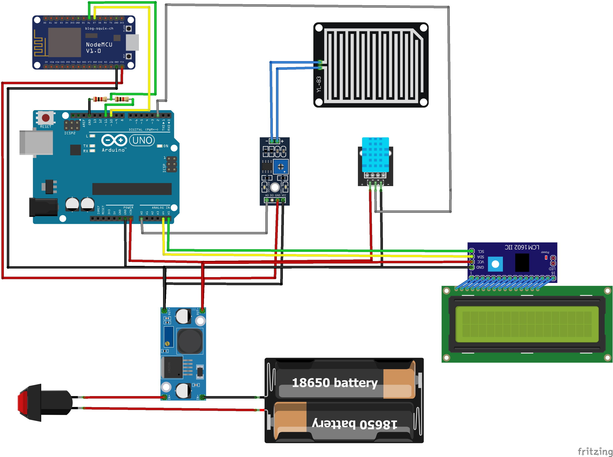
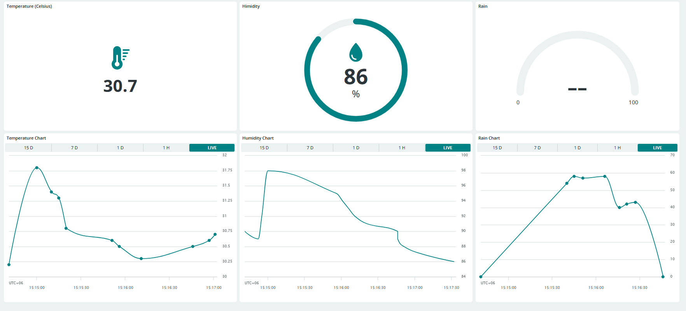

# Weather Station

Reads temperature, humidity, and rain level and sends the data live to the Arduino IoT Cloud.

---

## How it works

1. **Power** — A 8.4V Li-ion battery pack (two 3.7V cells in series) feeds a buck converter that steps it down to 5V. Both boards run off this 5V output.

2. **Sensing** — The Arduino Uno reads the DHT11 sensor (temperature + humidity) and the rain sensor every 5 seconds.

3. **Sending** — The Arduino formats the readings as a simple string like `25.3,60.1,12` and sends it to the ESP8266 over a serial wire.

4. **Voltage divider** — The Arduino talks at 5V but the ESP8266 only tolerates 3.3V on its RX pin. A 1kΩ + 2kΩ resistor divider sits between them to drop the signal safely.

5. **Cloud** — The ESP8266 parses the string, extracts the three values, and pushes them to the Arduino IoT Cloud over Wi-Fi. Values only upload when they change.

---

## Wiring diagram



---

## Arduino IoT Cloud setup

### 1. Create a Thing

- Go to [Arduino IoT Cloud](https://cloud.arduino.cc) and sign in.
- Click **Create Thing** and give it a name (e.g. `WeatherStation`).
- Under **Associated Device**, click **Add Device** → select **ESP8266** → follow the steps to get your **Device ID** and **Secret Key**. Paste them into `esp8266.ino`:

```cpp
const char DEVICE_ID[]  = "xxxxxxxx-xxxx-xxxx-xxxx-xxxxxxxxxxxx";
const char SECRET_KEY[] = "your_secret_key_here";
```

### 2. Add cloud variables

Inside your Thing, add three variables:

| Name | Type | Permission | Update policy |
|---|---|---|---|
| `temperature` | Float | Read only | On change (threshold 0.1) |
| `humidity` | Float | Read only | On change (threshold 0.1) |
| `rain` | Integer | Read only | On change (threshold 1) |

### 3. Set Wi-Fi credentials

In `esp8266.ino`, set your network name and password:

```cpp
const char SSID[] = "your_wifi_name";
const char PASS[] = "your_wifi_password";
```

### 4. Upload the sketch

- Install the **ArduinoIoTCloud** and **Arduino_ConnectionHandler** libraries from the Library Manager.
- Select **Generic ESP8266 Module** as the board.
- Upload `esp8266.ino`.

---

## Dashboard setup

Go to your Thing → **Dashboard** → **Edit** → add the following widgets:

### Temperature
- Widget: **Value**
- Linked variable: `temperature`

### Humidity
- Widget: **Percentage**
- Linked variable: `humidity`

### Rain
- Widget: **Gauge**
- Linked variable: `rain`
- Set range 0–100

### Charts
- Add a **Chart** widget for each variable (`temperature`, `humidity`, `rain`) to see historical trends over time.

---

## Notes

- Both boards must share a common ground for serial communication to work.
- Buck converter should be rated at least 1A output.

### Dashboard preview

